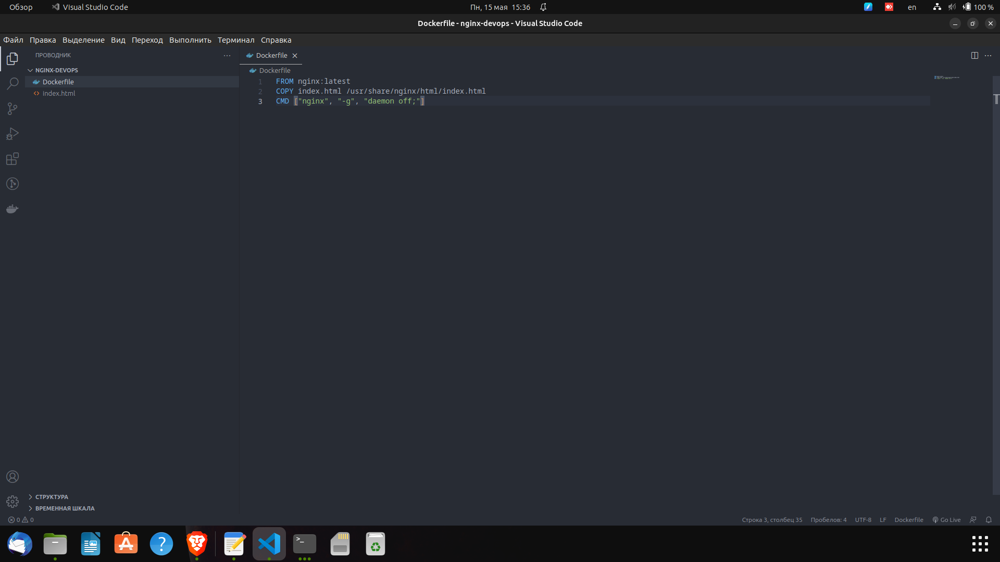
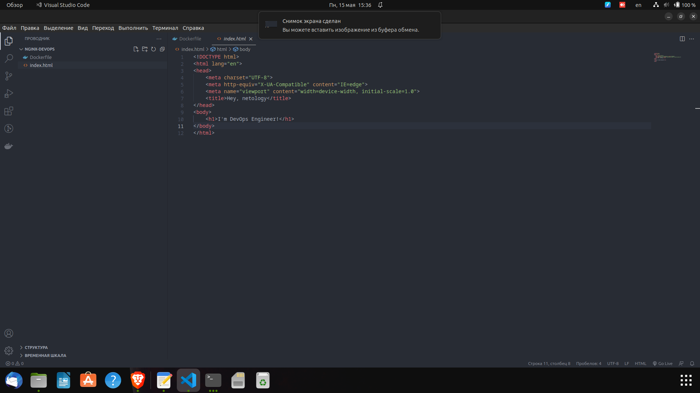
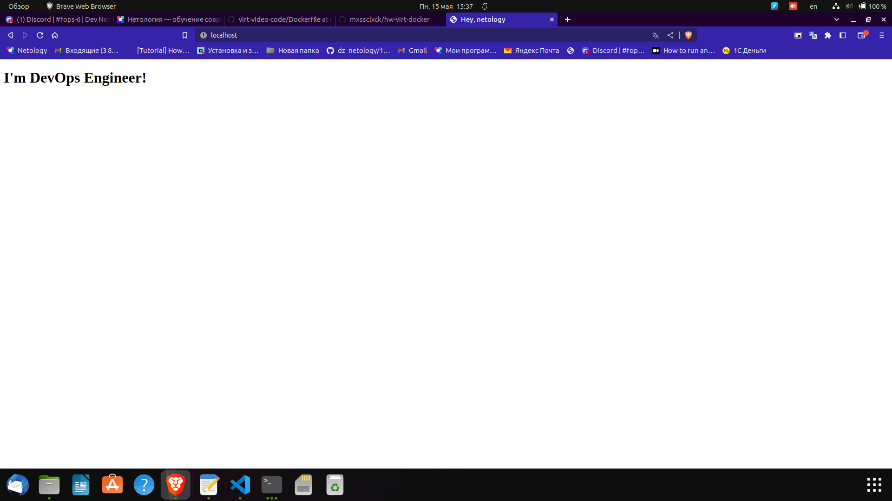
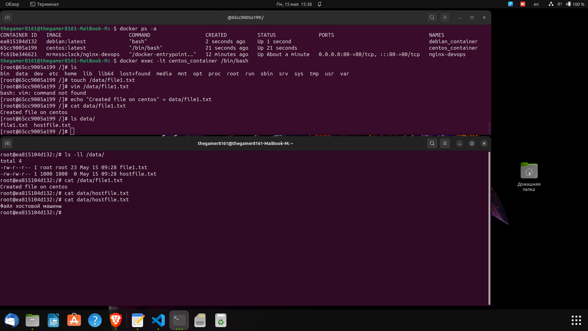
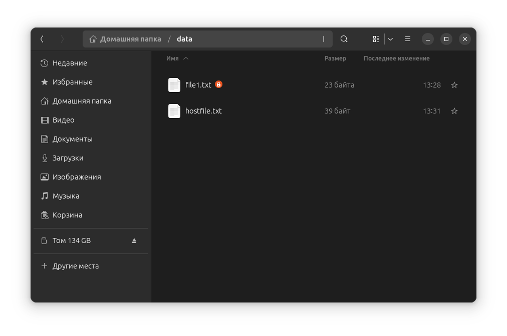

# Домашнее задание к занятию 3. «Введение. Экосистема. Архитектура. Жизненный цикл Docker-контейнера»
# Никоноров Денис - FOPS-6

## Задание 1
Сценарий выполнения задачи:

создайте свой репозиторий на https://hub.docker.com;
выберите любой образ, который содержит веб-сервер Nginx;
создайте свой fork образа;
реализуйте функциональность: запуск веб-сервера в фоне с индекс-страницей, содержащей HTML-код ниже:
```
<html>
<head>
Hey, Netology
</head>
<body>
<h1>I’m DevOps Engineer!</h1>
</body>
</html>
```
Опубликован созданный fork в своём репозитории
https://hub.docker.com/r/mrmxssclxck/nginx-devops





## Задание 2

Посмотрите на сценарий ниже и ответьте на вопрос: «Подходит ли в этом сценарии использование Docker-контейнеров или лучше подойдёт виртуальная машина, физическая машина? Может быть, возможны разные варианты?»

Детально опишите и обоснуйте свой выбор.

--

Сценарий:

* высоконагруженное монолитное Java веб-приложение;
* Nodejs веб-приложение;
* мобильное приложение c версиями для Android и iOS;
* шина данных на базе Apache Kafka;
* Elasticsearch-кластер для реализации логирования продуктивного веб-приложения — три ноды elasticsearch, два logstash и две ноды kibana;
* мониторинг-стек на базе Prometheus и Grafana;
* MongoDB как основное хранилище данных для Java-приложения;
* Gitlab-сервер для реализации CI/CD-процессов и приватный (закрытый) Docker Registry.

В данных сценарях наилучшим вариантом будет использование контейнеров Docker. Рассмотрим причины:

1. Высоконагруженное монолитное Java веб-приложение - для удобства разработки и развёртывания, контейнеры Docker позволяют упаковывать приложения и их зависимости вместе, что упрощает процесс сборки и внедрения приложений.

2. Nodejs веб-приложение - для данного веб-приложения можно создать отдельный контейнер, что позволит упростить управление версиями Nodejs и избежать конфликтов между зависимостями.

3. Мобильное приложение c версиями для Android и iOS - для обеспечения переносимости мобильных приложений между различными платформами, контейнеризация является наиболее эффективным вариантом.

4. Шина данных на базе Apache Kafka - использование контейнеров позволит гибко масштабировать и развертывать Kafka-брокеры на разных узлах с учётом использования ресурсов.

5. Elasticsearch-кластер - контейнеризация Elasticsearch-кластера обеспечит многоплатформенность и возможность быстрого развертывания и настройки.

6. Мониторинг-стек на базе Prometheus и Grafana - также может быть контейнеризован для удобства управления и развертывания.

7. MongoDB - также может быть контейнеризован для обеспечения переносимости между различными окружениями.

8. Gitlab-сервер для реализации CI/CD-процессов и приватный (закрытый) Docker Registry - Gitlab-сервер может быть запущен в Docker-контейнере, а приватный Docker Registry обеспечит дополнительную защиту конфиденциальности и безопасности.

Таким образом, использование Docker-контейнеров позволит обеспечить гибкость, масштабируемость, переносимость и удобство в управлении всего стека технологий, используемых в данном сценарии.

## Задание 3

* Запустите первый контейнер из образа centos c любым тегом в фоновом режиме, подключив папку /data из текущей рабочей директории на хостовой машине в /data контейнера.
* Запустите второй контейнер из образа debian в фоновом режиме, подключив папку /data из текущей рабочей директории на хостовой машине в /data контейнера.
* Подключитесь к первому контейнеру с помощью docker exec и создайте текстовый файл любого содержания в /data.
* Добавьте ещё один файл в папку /data на хостовой машине.
* Подключитесь во второй контейнер и отобразите листинг и содержание файлов в /data контейнера.


